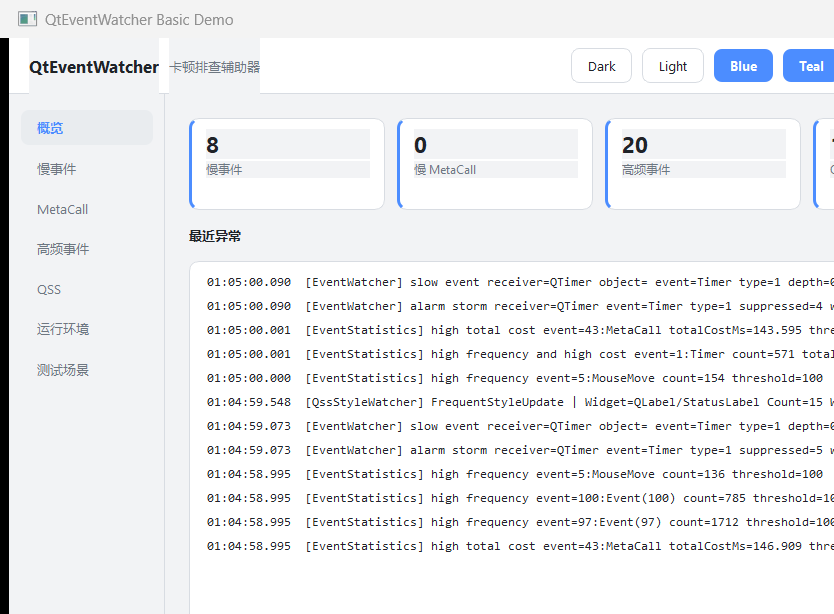
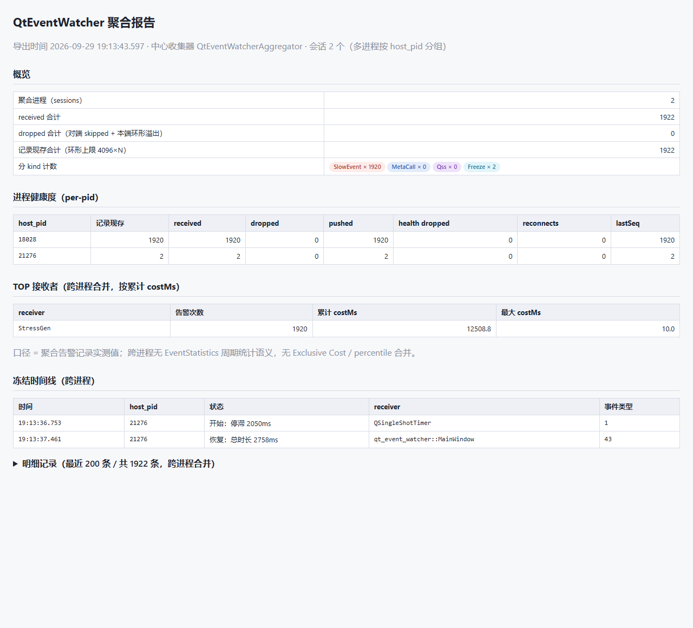

# QtEventWatcher — Lightweight ANR Watchdog & Event Profiler for Qt

<p align="right"><a href="README.md">中文</a> | <b>English</b></p>

[](https://github.com/sclzj595/qtEventWatcher/actions/workflows/regression.yml)
[](LICENSE)
[](https://www.qt.io/)
[](docs/02_需求范围与版本矩阵.md)
[](CMakeLists.txt)
[](tests/unit/UnitTests.cpp)
[](scripts/static-check.ps1)
[](docs/21_版本规划与交付物.md)

> Suggested repo description (paste into GitHub/Gitee About, recommended topics: `qt` `cpp` `performance` `profiler` `anr` `desktop`):

```text
Lightweight ANR watchdog & event-level profiler for Qt Widgets: times every event through notify(), slow event/signal/freeze alerts with function-level stack attribution, ~140 ns/event overhead.
```

A lightweight ANR watchdog and event-level performance profiling component for Qt Widgets desktop applications: intercepts `QApplication::notify()` to time every event, detects slow events / slow MetaCalls (queued cross-thread signals) / QSS load jank / main-thread freezes (ANR), aggregates periodic statistics, and automatically captures call stacks down to function level for slow events — with logging, report export, and live tuning from external processes.

> **Overhead quantified down to nanoseconds**: ≈140 ns/event when fully disabled (0.0008% of a 60 FPS frame budget), <1 µs/event when monitoring is enabled, and the alarm path is paid only by events that already exceed the threshold — the watchdog itself never becomes the source of jank. Full four-matrix (Qt 5.15/6.5 × MSVC/MinGW) benchmark data in [docs/22_性能基准报告.md](docs/22_性能基准报告.md) (Chinese).

<p align="center">
  <br>
  <em>examples/basic 7-page diagnostic UI — overview page, live (animated)</em>
</p>

<p align="center">
  <br>
  <em>Self-contained aggregation report from <code>aggregator</code> (zero JS) — multi-process, grouped by host_pid</em>
</p>


## Core Features

- **Global event monitoring**: `notify()` override times every event; slow event / slow MetaCall / QSS jank alarms by category; configurable thresholds with INI / IPC hot-reload at runtime
- **Function-level attribution**: automatic call-stack capture for slow events (≤32 frames + module ownership), alarm storm suppression (1 s window) keeps logs readable
- **ANR watchdog**: main-thread heartbeat + dedicated polling thread, freeze alarms in started / ongoing / recovered states
- **Multi-process aggregation**: monitored processes stream NDJSON over named pipes to a central `aggregator` (grouped by pid) with a self-contained HTML aggregation report (zero JS)
- **Data sinks**: CSV / JSON / SQLite full replay, nine-section diagnostic report, rule-based attribution summary, single-process & aggregated HTML reports
- **Safe degradation**: parser failures degrade gracefully, logging faults never crash the host, monitoring failure never affects the target application (PRD 14)

## Quick Integration (3 steps)

### 1. Add to your build

Add this repository as a subdirectory of your host project:

```cmake
add_subdirectory(QtEventWatcher)            # builds QtEventWatcherCore (static lib) automatically
target_link_libraries(YourApp PRIVATE QtEventWatcherCore)
```

Or via `find_package(QtEventWatcher)` (run `cmake --install . --prefix <dir>` first and point at that prefix; spdlog is provided automatically through the source sub-build).

### 2. Swap the Application class and init logging

```cpp
#include "CusApplication.h"
#include "WatchLogger.h"

int main(int argc, char* argv[])
{
    qt_event_watcher::CusApplication app(argc, argv);   // replaces QApplication
    qt_event_watcher::WatchLogger::instance().initialize("./logs");
    return app.exec();
}
```

Constructing `CusApplication` assembles the whole monitoring chain (config loading, four monitor pipelines, INI hot-reload polling, IPC server). If logging is never initialized, all `QEW_LOG_*` macros compile/sink to silence — no hard dependency.

### 3. Enable monitoring

**Environment variables** (set before process start):

```text
QT_EVENT_WATCHER_WATCH_FUN=15        # bit mask: 1 slow event / 2 MetaCall / 4 periodic stats / 8 QSS / 15 all
QT_EVENT_WATCHER_SLOW_EVENT_THRESHOLD_MS=30
```

**Or INI** (default `./QtEventWatcher.ini`; edits hot-reload at runtime, no restart needed):

```ini
[QtEventWatcher]
Watch_Fun=15
SlowEventThresholdMs=30
SlowMetaCallThresholdMs=30
EventStatPeriodMs=1000
```

Precedence: defaults → env vars → INI → runtime setters. All environment variables and threshold semantics in [docs/13_配置项与阈值.md](docs/13_配置项与阈值.md) (Chinese).

## Optional Capabilities

| Capability | How to enable | Notes |
|---|---|---|
| QSS load monitoring | wrap loading & `setStyleSheet` with `QssStyleWatcher::instance()->beginLoadQss(path)` / `endLoadQss()` | records IO and style-apply latency |
| IPC live tuning | none — on by default (endpoint `QtEventWatcher.<pid>`) | external process rewrites config over QLocalSocket JSON-line protocol, see `examples/ipc-console` |
| Multi-process aggregation | set `QT_EVENT_WATCHER_UPLINK_NAME=<server>` in monitored processes + run `aggregator` | `--html` emits a self-contained aggregation report, `--out` a JSON export, see `examples/aggregator` |
| Data export | `ReportExporter` (nine-section report) / `DataExporter` (CSV/JSON/SQLite) / `HtmlReporter` (single-process HTML) / `DiagnosticSummarizer` (attribution summary) | entry points in `src/runtime/` |
| Runtime diagnostics | `RuntimeDiagnostics` | Qt environment / module enumeration / dependency tree, uses no Watch_Fun bit |

## Examples

- [examples/basic](examples/basic/) — 7-page diagnostic UI (overview / details / runtime environment / test scenarios / export) with QSS instrumentation, theme tokens, export buttons
- [examples/aggregator](examples/aggregator/) — central multi-process collector (live tail / JSON / HTML aggregation report)
- [examples/ipc-console](examples/ipc-console/) — external console that live-tunes another process's monitoring behavior

## Build & Test

**CMake presets (recommended)** — the Qt path is injected via an environment variable, no file edits needed:

```powershell
$env:QT_EVENT_WATCHER_QT_DIR = "<Qt>/5.15.2/msvc2019_64"   # or 6.5.3, any Qt prefix
cmake --preset windows-msvc          # also: windows-msvc2022 / windows-mingw / linux-gcc
cmake --build --preset windows-msvc --config Release
ctest --preset windows-msvc -C Release
```

MinGW additionally needs `QT_EVENT_WATCHER_MINGW_BIN` pointing at the toolchain bin dir. Requires CMake ≥ 3.21.

> **VS2022 (17.13+) + Qt 6.5.x build note**: recent MSVC STL removed `stdext`, which
> Qt 6.5.x's `qcompilerdetection.h` still references (QTBUG-111580, fixed in Qt ≥ 6.6),
> causing `C2065: 'stdext'` in `qvarlengtharray.h`. Either upgrade to Qt ≥ 6.6, or apply
> the two-line passthrough patch to the Qt install tree as done in the
> [Install Qt step of regression.yml](.github/workflows/regression.yml) (checked array
> iterators are a debug-safety wrapper only — zero semantic difference). This repo's CI
> stays green on windows-latest with that patch.

**Classic way**:

```powershell
cmake -S . -B build -G "Visual Studio 16 2019" -A x64   # or -G Ninja + a MinGW toolchain
cmake --build build --config Release
ctest -C Release                                        # smoke tests (run inside the build dir)
```

One-shot regression (build + smoke + benchmark drift detection, four matrices): `scripts/run_regression.ps1` — parameters documented in the script header.

## Documentation

The complete PRD collection (01~29: architecture / protocols / performance / release engineering, all in Chinese) lives in [docs/README.md](docs/README.md) (index). Key entries:

- Integration & adaptation: [docs/23_集成与适配说明.md](docs/23_集成与适配说明.md) (spdlog / Qt version compatibility / MetaCall ABI)
- Overhead evidence: [docs/22_性能基准报告.md](docs/22_性能基准报告.md)
- Event models: [docs/05_全局事件耗时监控.md](docs/05_全局事件耗时监控.md), [docs/06_MetaCall跨线程信号监控.md](docs/06_MetaCall跨线程信号监控.md)
- Configuration reference: [docs/13_配置项与阈值.md](docs/13_配置项与阈值.md)

## Roadmap

- [x] **V6 quality line**: pure-logic unit tests + static analysis gates + ASan evidence ([docs/31](docs/31_V6实施计划.md))
- [ ] **Scout out-of-process probe (product line B)**: jank detection for *any* desktop app (Electron/WPF/Win32) from outside, aggregated into the same reports — **S1 delivered**: T1 window-freeze + T1b CPU heuristic ([examples/scout](examples/scout/), [docs/32](docs/32_V7-Scout实施计划.md)); S2 planned: precise renderer long-task jank for Electron via CDP
- [ ] Linux support (portability already reserved in code; validation pending a real environment)
- [ ] QML / Qt Quick event-path coverage (currently Widgets-focused)
- [ ] Flame-graph export (stack data already captured; renderer missing)
- [ ] vcpkg / Conan packaging

## Changelog

See [CHANGELOG.md](CHANGELOG.md).

## License

[MIT](LICENSE)
